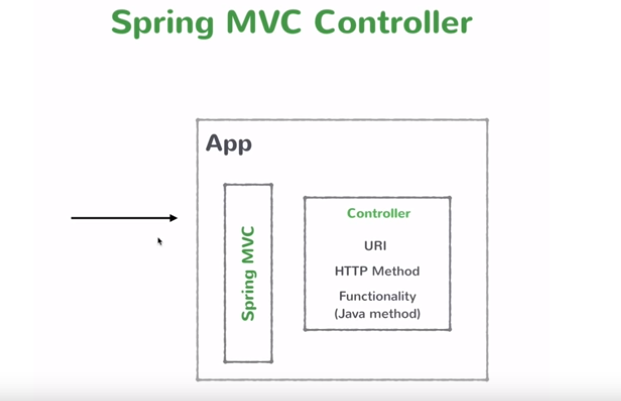
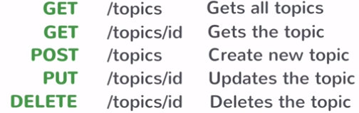
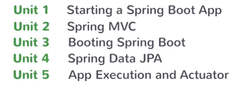

# Pro-SpringBoot
SpringBoot Projects - from Scratch to Pro

# Entire Course here(Videos):
https://javabrains.io/courses/spring_bootquickstart/

# Many many thanks to Kaushik for bringing this up!

# For Documentation and Code take the clone and refer this Documentation

# Postman collection here for course-api:
https://www.getpostman.com/collections/c89f6a546708e1aeb96b

# Postman Collection here for course-api-data :
https://www.getpostman.com/collections/8777bb720eca8bffc705

# UNIT 1:(Introducing Spring Boot)

# Video 1:(Introduction)
Spring - Enterprise java framework that lets us create enterprise java applications.
Spring boot - a way in which we can bootstrap or quickly startup a simple as well as complex production ready spring applications.

# Video 2:(About the Course)
What is Springboot?
What's the benefit of using Springboot framework?
Build an end to end app
Springboot features
Configuration and Customization

# Video 3:(What is Springboot?)
Spring-boot makes it easy to create stand-alone(runs of its own),production-grade Spring based applications that you can "Just-run".

# Video 4: (Spring and Some of its problems)
What's Spring?
	* Application Framework
	* Programming and Configuration model
	* Infrastructure Support

Problems with Spring?
	* Huge framework
	* Multiple Setup Steps
	* Multiple Configuration Steps
	* Multiple Build and Deploy steps
	* Doesn't have a starting point,you are left to figure it out

# Video 5:(What Spring boot gives us?)
	* It abstracts out infrastructure concerns and lets us focus on business logic only.
	* Opinionated
	* Convention over configuration
	* Standalone
	* Production grade

# Video 6:(Setting up development environment)
Java 8 SDK(from Oracle)
Spring STS(spring.io)
Set JAVA_HOME - Used by external software like Apache Tomcat
To check:
"where java"
echo %JAVA_HOME%

# Video 7:(Maven)
A build and dependency management tool. Looks out for all dependencies in POM.xml and gets from REPO. Keeps them in Maven Dependencies and Classpath,
Also let us create Archtype or starter project via which we don't have to pull individual jars.

# Video 8:(Creating a Springboot project)
Package explores -> Right-click -> Maven Project ->Use Default(create a simple project(Skip archetype selection) ->Group ID(Package name for namespace),Artifact Id(Project Name)  ->Finish

Steps to convert Maven project to a springboot one:
	1. Add the parent dependency
	2. Add the sub dependencies to pull JAR alike to the project.(meta dependency - archetype depeendency)
	3. Add properties
	4. Right click on Project - > Maven -> Update Project

# Video 9:(Starting a Spring Boot Application)
Steps to start and host a Springboot Application in Servlet Container:
	1. Annotate your main class(Class with Main method) with @SpringBootApplication
	2. Add the static method SprintApplication.run

# Video 10:(Spring boot startup steps)
What Springboot does when you run the application.
	1. Sets up default configuration
	2. Starts Spring Application context
	3. Performs class path scan
	4. Starts Tomcat Server

# Video 11: (Adding a REST controller)
A Controller is a
	* A java class
	* Marked with Annotations
	* Has info about
        What URL access triggers it?
        What method to run when accessed?
    @RestController - Class marked under it will have methods that will get executed based on specific requests.
    @RequestMapping("url") -  Maps only to GET method by default.To map to the other HTTP methods,you will have to specify it in the   @RequestMapping  annotation.
When the application starts it does a class path scan and registers all the controllers services along with method that needs to be executed.

# Video 12: (Returning Objects from Controller)
@RestController checks for the return type of method converts it into JSON and returns it back.

# Video 13:(What's happening here:Bill of Materials)
Parent doesn't pulls any Maven dependencies. It just specifies what JAR's to pull when you have it. Its just specification of Configuration. What version of the dependencies are specified here.
The dependency section pulls all the jar's.
Which set of jar to pull for the specified version is called bill of materials.

# Video 14:(What's happening here: Embedded Tomcat Server - Embedded Servlet Container)
Benefits:
	* Convenience
	* Servlet container config is now application config
	* Standalone application
	* Useful for microservices architecture

# UNIT 2(Spring MVC: The View Tier)

# Video 15:(How Spring MVC works - The View Tier)

Spring MVC framework takes care of converting returned response into JSON.

# Video 16:(The REST api we'll build)
REST API deals with entities or noun as resources.

Resources: Topic,Course,Lesson
A topic can have multiple courses and a course can have multiple lessons.

 

# Video 17:(Creating a Business Service)
Service - In spring business service are singletons. When the application starts up it creates an instance of this services it keeps it in memory it registers that instance and other service other classes  or other controllers which depend on this. It declares a dependency and spring injects them.
Steps: 
	1. Create a  Service class
	2. Create method to access that service class data
	3. Create an instance of the service class in controller
	4. Autowire  or link it(@Autowired)
	5. Create a method in it
	6. Call the method of Service class using Service class instance

# Video 18:(Getting a Single resource)
Annotations:
@RestController
@RequestMapping
@Service
@Autowired
@Pathvariable("parameter")

# Video 19:(Creating a new resource using POST)
@RequestMapping(method=RequestMethod.POST,value="/topics")
@RequestBody Topic topic

# Video  20:(Implementing UPDATE and DELETE)
For PUT:
@RequestMapping(method=RequestMethod.PUT,value="/topics/{Id}")
@RequestBody Topic topic,@PathVariable("Id") String id
For DELETE:
@RequestMapping(method=RequestMethod.DELETE,value="/topics/{id}")
@PathVariable String id

# UNIT 3(Booting Spring Boot)

# Video 21:(Unit Overview)

Starting a Spring Boot app 
	* Spring Initializr
	* Spring Boot CLI
	* STS IDE

Configuration

# Video 22:(Using Spring Initializr)
Website: http://start.spring.io

# Video 23:(Spring Boot CLI)
Works using groovy scripts
(Least used)

# Video 24:(Using STS IDE)
Right click -> New-> Spring starter project
Takes the project from start.spring.io

# Video 25:(Using application properties)
Know the properties on: https://docs.spring.io/spring-boot/docs/current/reference/html/common-application-properties.html
Gives default value of set properties as well

# UNIT 4(Spring DATA JPA: The Data Tier)

# Video 26:(What is JPA)
Stands for Java Persistence API
Its a specification that lets you do ORM.
ORM lets one map entity classes into sequel tables,so that when you connect to database you provide some type of meta data on your entity classes so that you don't have to do the query and mapping yourself. The framework handles it for us that's ORM.
JPA is a way to use ORM.It gives API spec that lets you configure your entity classes and give it to framework that does rest of the things.
Spring DATA JPA which makes working with ORM tools even easier.

# Video 27:(Adding Spring Data JPA)
Right click -> New-> Spring starter project -> Fill groupid artifcat id -> SQL(Apache derby),Web(Spring starter),SQL(JPA)-> Finish

# Video 28:(Creating a Spring Data JPA Repository)
Step 1: Add the Dependency - Apache Derby and Spring Data JPA
Step 2: Create a TopicRepository and Extend the CrudRepository . Add generics <Topic,String>

# Video 29: (Making CRUD operations with Repository)
Step 1: Create the entity and primary key by @Entity on POJO and @Id on property
Step 2: Connect to database and perform the operations.

# Video 30: (Adding Course APIs)
Using the CrudRepository as dependency via @Autowired annotation add the functionality and API's.

# Video 31: ( Adding Entity Relationship and Extending Repository)
Establish the Dependency between Topic and Course via has a relationship and @ManyToOne annotation

# UNIT 5(Deployment and Monitoring)

Video 32: (Packaging and running a Spring Boot app)
mvn clean install
java -jar target/jarname.jar
To Change to WAR:
pom.xml change packaging to WAR

To package with Maven it would be enough to execute: > mvn clean package Executing "mvn install" it of course makes a package too, but also after packaging installs the artifact to the local Maven repository ( ~/.m2 by default)

mvn clean install doesn't work if you don't have Maven installed on your system and added to the PATH variable, but you have a Maven wrapper in your project so just do: mvnw clean install and it should work

# Video 33:(Spring Boot Actuator)
Steps 1:
1.Add the dependency:
<dependency>
            <groupId>org.springframework.boot</groupId>
            <artifactId>spring-boot-starter-actuator</artifactId>
</dependency>
2. With Spring Boot 2.0.0 you need to use /actuator/health Also, in the application properties file, you have to add the following line in order to see the details when using the /actuator/health endpoint. management.endpoint.health.show-details=always

# Video 34:(Wrap UP)

 

